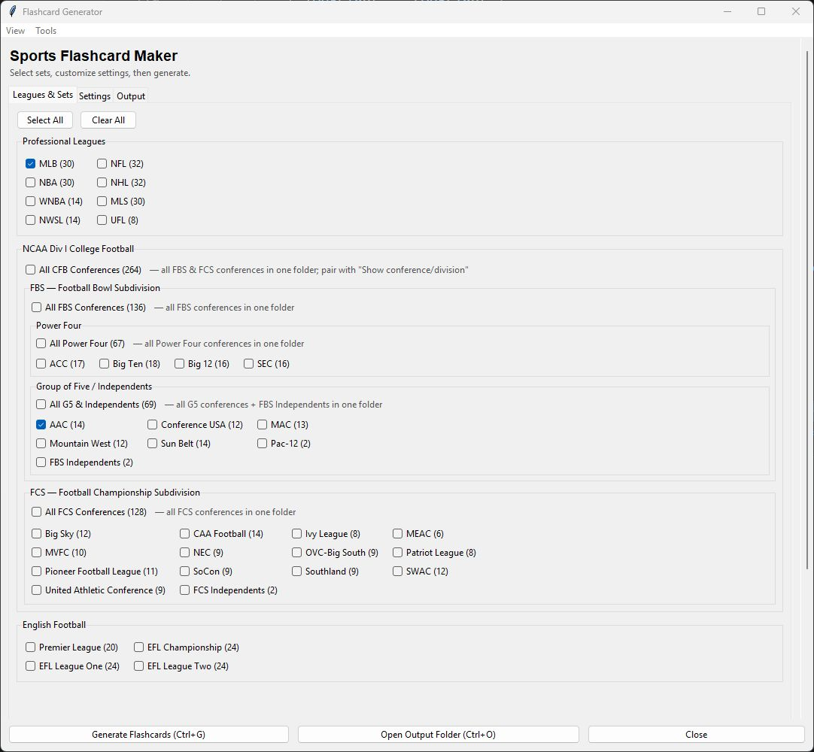
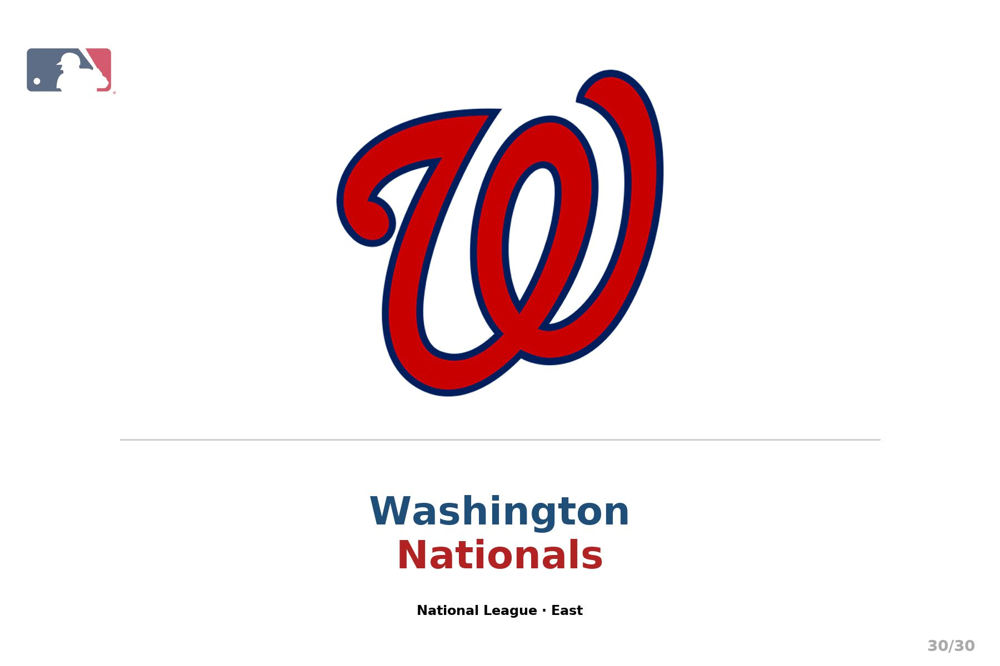

# Sports Flashcard Maker

*Because googling "what team is that logo?" for the fifteenth time is a sport in itself.*

  





---

## About

Remembering 30 MLB logos is hard. Remembering all 134 FBS college football teams is a personality disorder. Most flashcard apps want you to manually drag-and-drop images, write text by hand, and then export to a format that prints crooked anyway.

Sports Flashcard Maker fetches official team logos straight from ESPN's API, then renders pixel-perfect, print-ready PNG flashcard images with zero manual effort. Point it at a league, pick your card size, and it does the rest — logo cards, text cards, combo cards, the works.

> **Repository:** https://github.com/AdamMoses-GitHub/SportsFlashcardMaker

---

## What It Does

### The Main Features

- **50+ leagues and conferences** — every major North American pro league (NFL, NBA, NHL, MLB, MLS, WNBA, NWSL, UFL, CFL), all FBS/FCS college football conferences, English football's top four divisions, and international soccer (La Liga, Bundesliga, Serie A, Ligue 1)
- **Three card types** — logo-only, text-only, and combo (logo + text) cards in a single run
- **Flexible naming** — full city+team name, team-only, or city-only; prefix or suffix filename formats
- **Desktop GUI** — a full tkinter interface with live filename preview and progress tracking
- **Batch generation** — generate multiple sets in one command, each landing in its own output folder
- **Print-quality output** — configurable DPI (default 300), nine aspect ratios from 1×1 square to 10×8 landscape

### The Nerdy Stuff

- Concurrent logo downloads via `ThreadPoolExecutor` (8 workers) — a 30-team set downloads in seconds
- ESPN public API integration — no API key, no account, no rate-limit drama
- Disk caching of raw logos — re-runs skip the network entirely unless `--force-refresh` is set
- Pillow-based rendering with a smart font fallback chain (`DejaVuSans-Bold → arialbd → Arial → default`)
- ALL-CAPS API names are auto-normalized to Title Case while preserving known acronyms (BYU, UCLA, ECU…)
- Logo URLs validated against ESPN-owned domains before any network request is made
- Automatic retry with exponential backoff on transient network errors (up to 3 attempts)

---

## Quick Start (TL;DR)

Full installation and usage guide: [INSTALL_AND_USAGE.md](INSTALL_AND_USAGE.md)

```bash
git clone https://github.com/AdamMoses-GitHub/SportsFlashcardMaker
cd SportsFlashcardMaker
pip install -e .
sports-flashcards --set mlb
```

---

## Tech Stack

| Component | Purpose | Why This One |
|---|---|---|
| **Python 3.10+** | Core language | Match expressions, modern type hints |
| **Pillow ≥ 10.4** | Image rendering & compositing | The only serious image library in Python |
| **requests ≥ 2.32** | ESPN API + logo downloads | Battle-tested, simple session management |
| **tkinter** | Desktop GUI | Ships with Python, zero extra dependencies |
| **setuptools ≥ 68** | Package build | Standard, works everywhere |

---

## License

MIT © 2026 Adam Moses

## Contributing

PRs welcome. Open an issue first for anything bigger than a bug fix.

---

<sub>sports flashcards team logos ESPN API print flashcards MLB NFL NBA NHL CFL college football FBS FCS MLS Premier League La Liga Bundesliga Serie A Ligue 1 WNBA UFL NWSL CFL Python Pillow tkinter flashcard maker logo downloader</sub>
